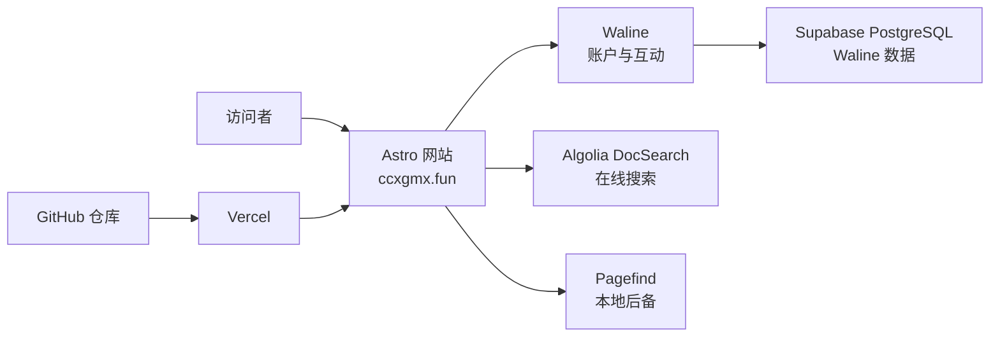

# 系统架构

## 一句话架构

Astro 负责内容和页面，Vercel 负责构建与运行，Waline 负责用户互动，Supabase PostgreSQL 只保存 Waline 数据，Algolia 提供在线搜索，Pagefind 提供无需网络后端的搜索后备。

## 系统边界

| 模块                | 负责                                               | 不负责                         |
| ------------------- | -------------------------------------------------- | ------------------------------ |
| Astro 网站          | 页面、文章、导航、RSS、搜索入口、Waline 客户端     | 数据库密码、用户认证实现       |
| Waline 服务         | 注册登录、评论、回复、反应、留言板、管理端         | 博客内容与页面构建             |
| Supabase PostgreSQL | 持久化 Waline 的 `wl_` 数据                        | 浏览器端 Auth 和博客内容       |
| Algolia DocSearch   | 已公开技术内容的在线索引与搜索                     | 评论、账户和留言板索引         |
| Pagefind            | 构建期静态搜索后备                                 | 用户互动数据                   |
| Vercel              | 预览、生产部署、运行时和环境变量                   | 内容编辑                       |

Astro 项目和 Waline 是两个独立的 Vercel 项目。Astro 项目只接收可公开到浏览器的 Waline 地址和 Algolia 只读搜索配置；数据库、邮件和 OAuth 秘密只存在于 Waline 项目。

## 数据流

### 页面访问

1. 访问者请求 `https://ccxgmx.fun`。
2. Vercel 返回 Astro 生成的页面和静态资源。
3. 文章来自 `src/content/blog/` 的 Markdown/MDX 内容集合。
4. 页面导航、个人资料和视觉配置来自 `src/site.config.ts` 与 `src/data/profile.ts`。

项目使用 Vercel adapter 和 `output: 'server'`，但主题配置会预渲染可静态生成的内容页面。RSS、站点地图和 Pagefind 索引也在构建阶段生成。

### 评论与登录

1. 文章页或留言板加载本地 `WalineThread` 组件。
2. 组件读取 `PUBLIC_WALINE_SERVER_URL`，连接独立的 Waline 服务。
3. Waline 完成邮箱/GitHub 登录、评论、回复、文章反应和个人资料操作。
4. Waline 服务端通过私有 PostgreSQL 配置读写 Supabase 中的 `wl_` 表。

如果 Waline 地址缺失、无效或服务不可用，文章正文仍然正常显示，互动区域只呈现不可用提示。

### 在线搜索与本地后备

1. `src/lib/search/config.ts` 读取三项 Algolia 公共变量。
2. 三项变量都存在时，搜索页加载 Algolia DocSearch。
3. 任一变量缺失时，搜索页直接使用 Pagefind。
4. Algolia 已启用但运行失败时，页面仍保留“使用本地搜索”入口。

Algolia 爬虫只抓取公开网站，不接触 Waline 服务、账号页、留言板或管理端。

### Git 推送到生产

1. 代码推送到 GitHub 功能分支后，Vercel 创建 Preview Deployment。
2. 同一提交进入 `main` 后，Vercel 创建 Production Deployment。
3. 构建依次执行 Astro Pure 配置检查、Astro 类型检查、Astro 构建和 Pagefind 索引。
4. Production Deployment 变为 `READY` 后，`ccxgmx.fun` 指向新版本。

## 关键设计决策

- 网站浏览器端不直接连接 Supabase，避免维护两套认证和互动逻辑。
- Waline 故障不影响文章正文与静态页面。
- 三项 Algolia 公共配置缺一时自动使用 Pagefind。
- Pagefind 即使在 Algolia 启用后也继续构建，避免在线搜索成为单点故障。
- `main` 是生产环境的代码事实来源。
- 博客正文保存在 Git 中，不引入 CMS；内容修改通过代码提交发布。

## 关键源码入口

| 路径                              | 职责                                         |
| --------------------------------- | -------------------------------------------- |
| `src/pages/`                      | 首页、文章、标签、归档、搜索、留言板等路由   |
| `src/content/blog/`               | 已发布的 Markdown/MDX 文章                   |
| `src/content.config.ts`           | 文章 frontmatter schema 和标签规范化         |
| `src/site.config.ts`              | 主题、导航、页脚、语言和 Pure 集成配置       |
| `src/data/profile.ts`             | CC 的公开资料与技能内容                      |
| `src/components/waline/`          | Waline 客户端包装和失败状态                  |
| `src/lib/waline/config.ts`        | Waline 公共地址校验与路径规范化              |
| `src/components/search/`          | DocSearch UI 与 Pagefind 后备入口            |
| `src/lib/search/config.ts`        | Algolia/Pagefind 模式选择                    |
| `scripts/import-obsidian-posts.ts`| Obsidian 笔记到博客文章的确定性导入          |
| `astro.config.ts`                 | Vercel adapter、Markdown、Shiki 与构建配置   |
| `packages/pure/`                  | 随项目保留的 Astro Theme Pure 本地支持代码   |
| `tests/`                          | 内容、页面、搜索、Waline、品牌和构建契约     |

## 延伸阅读

- [本地开发与项目结构](development.md)
- [Vercel 部署、域名与环境变量](deployment.md)
- [Waline、Supabase、Algolia 与 Pagefind](integrations.md)
- [项目演进与关键决策](project-history.md)
