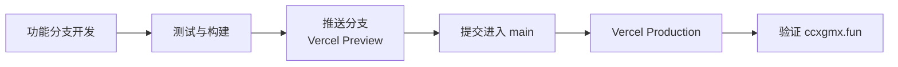

# Vercel 部署、域名与环境变量

网站通过 GitHub 与 Vercel Git Integration 自动部署，不使用 GitHub Actions。

## 当前生产信息

- 正式域名：[https://ccxgmx.fun](https://ccxgmx.fun)
- Vercel 项目：`cc-xgmx2005`
- 生产分支：`main`
- 代码仓库：[https://github.com/xgmx2005/myblog](https://github.com/xgmx2005/myblog)
- Astro adapter：`@astrojs/vercel`

`.vercel/project.json` 只保存本地项目关联信息并被 Git 忽略。不要把 Vercel OIDC token 或其他访问令牌写入仓库。

## 部署流程



标准流程：

1. 在功能分支完成修改。
2. 运行 `bun test`、`bun run check` 和 `bun run build`。
3. 推送功能分支，等待 Preview Deployment。
4. 在预览地址检查页面、移动端、深浅色模式以及本次涉及的互动功能。
5. 将经过验证的同一提交合入并推送 `main`。
6. 等待 Production Deployment 变为 `READY`。
7. 从 `https://ccxgmx.fun` 验证实际页面，不能只检查 `vercel.app` 预览地址。

## 环境变量

Astro 网站项目使用：

| 名称                            | 环境建议                         | 说明                                  |
| ------------------------------- | -------------------------------- | ------------------------------------- |
| `SITE_URL`                      | Production、Preview 按需设置     | Astro canonical、RSS 和 sitemap origin|
| `PUBLIC_WALINE_SERVER_URL`      | Production、Preview、Development | Waline 公开服务地址                   |
| `PUBLIC_ALGOLIA_APP_ID`         | Production、Preview              | Algolia 公共应用 ID                   |
| `PUBLIC_ALGOLIA_SEARCH_API_KEY` | Production、Preview              | 仅允许搜索目标索引的只读密钥          |
| `PUBLIC_ALGOLIA_INDEX_NAME`     | Production、Preview              | 当前 DocSearch 索引名称               |

生产环境的 `SITE_URL`：

```text
https://ccxgmx.fun
```

在 Vercel Dashboard 修改环境变量后，需要重新部署才能进入新的构建产物。只改变变量但不重新部署，线上页面仍可能使用旧值。

Waline 的 PostgreSQL、SMTP、OAuth 和服务端安全变量属于独立的 `cc-waline` 项目，见 [外部服务集成](integrations.md)。

## 自定义域名

`ccxgmx.fun` 必须同时满足：

1. 域名已添加到 `cc-xgmx2005` Vercel 项目；
2. DNS 记录符合 Vercel Dashboard 给出的目标；
3. Vercel 显示域名配置有效并签发 HTTPS 证书；
4. `SITE_URL` 使用 `https://ccxgmx.fun`；
5. Waline 的安全域名包含 `ccxgmx.fun`；
6. Algolia 爬虫使用同一个正式域名。

如果 DNS 由 Cloudflare 或其他平台管理，应以 Vercel 当前显示的记录要求为准。修改后使用以下命令检查：

```powershell
Resolve-DnsName ccxgmx.fun
curl.exe -I https://ccxgmx.fun
```

域名可访问并不等于新部署已经生效，还要检查响应页面和 Vercel Production Deployment 的 commit SHA。

## 预览环境

功能分支会获得独立的 `*.vercel.app` 预览地址。预览适合验证静态页面和构建结果，但第三方服务可能限制允许域名：

- Waline 的 `SECURE_DOMAINS` 未包含预览域名时，互动请求可能被拒绝；
- Algolia 搜索使用公共配置，预览站可能仍返回正式域名索引；
- canonical、RSS 和 sitemap 应以对应环境的 `SITE_URL` 为准。

不要为了临时预览把宽泛通配域名长期加入安全配置。

## 重新部署

需要重新部署的场景：

- 修改 Vercel 环境变量；
- 上一次构建因临时网络问题失败；
- 域名已经切换，但当前生产 alias 仍指向旧 deployment；
- 需要使用同一 commit 重新生成构建产物。

在 Vercel Dashboard 打开目标 deployment，选择 Redeploy。重新部署不会改变 Git commit，只会重新执行构建。

## 回滚

优先使用可追溯的 Git 回滚：

```powershell
git revert <commit-sha>
git push origin main
```

紧急情况下可以在 Vercel Dashboard 将生产流量回滚到最近一个健康的 Production Deployment。随后仍应在 Git 中创建对应修复或 revert，避免下一次部署重新带回问题。

回滚后检查：

- 首页与受影响页面返回 HTTP 200；
- Waline 评论区可加载；
- `/search` 至少能使用 Pagefind；
- RSS 与 sitemap 可访问；
- `ccxgmx.fun` 指向预期 commit。

## 为什么没有 GitHub Actions

当前部署链路不需要额外工作流：

- GitHub push 已能自动触发 Vercel；
- Preview 与 Production 分支规则由 Vercel 管理；
- Vercel 保存环境变量和构建日志；
- 减少一套 token、YAML 和重复构建配置。

只有在以后需要独立的定时任务、跨平台发布或 Vercel 之外的构建产物时，才有必要增加 GitHub Actions。

## 发布验证

本地：

```powershell
bun test
bun run check
bun run build
```

线上：

```powershell
curl.exe -L -sS -o NUL -w "%{http_code}`n" https://ccxgmx.fun
curl.exe -L -sS -o NUL -w "%{http_code}`n" https://ccxgmx.fun/about
curl.exe -L -sS -o NUL -w "%{http_code}`n" https://ccxgmx.fun/rss.xml
curl.exe -L -sS -o NUL -w "%{http_code}`n" https://ccxgmx.fun/sitemap-index.xml
```

四个地址都应返回 200。随后再人工验证本次变更，而不是仅以部署状态作为完成依据。
